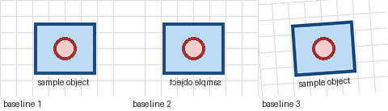
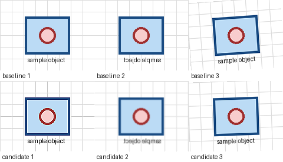

# AlbumentationsX MCP Demo Report

## Baseline

## Candidate

## Review

- Feedback tag: `too_noisy`
- Adjustment: reduce `GaussNoise` probability and noise range.
- Decision: Candidate accepted for a small robustness pass.
