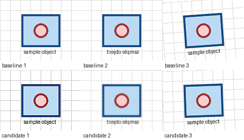

# Classification Robustness Review

Use AlbumentationsX MCP to test image-classification augmentations without accepting variants that destroy class
evidence. The useful outcome is one real `render -> reject -> adjust -> accept` decision, followed by a reproducible
pipeline export.



## Install

For Claude Desktop, [download the latest MCPB](https://github.com/dKosarevsky/albu-mcp/releases/latest/download/albumentationsx-mcp.mcpb)
and select separate image and artifact directories during installation.

For another MCP host, start the published package with bounded local access:

```bash
uvx --from albumentationsx-mcp albumentationsx-mcp \
  --allowed-root /absolute/path/to/images \
  --artifact-root /absolute/path/to/albu-artifacts
```

## Run The Review

Replace the image path, then send this prompt to the connected host:

```text
Call run_host_smoke_check. If preview_ready is true, call run_first_preview for
/absolute/path/to/images with classification task, medium intensity, seed 137, and at most 8 images.
Show me the contact sheet and wait for my review. When I identify a result, call trace_preview_variant
before changing it. If I reply too_noisy:high, reduce only the excessive noise, render a new batch with
the same seed, and compare the two runs. Export the pipeline only after I explicitly accept the result.
```

Use a small representative folder. The server reads only under `--allowed-root` and writes generated previews only
under `--artifact-root`.

## Accept Or Adjust

Accept a result only when:

- the class-defining object remains recognizable;
- color and exposure changes remain plausible for the deployment environment;
- noise, blur, crop, and geometry preserve label semantics;
- the adjusted contact sheet is visibly safer than the rejected candidate.

Reject an excessive candidate with a bounded tag such as `too_noisy:high`. The host should trace the exact variant,
adjust the existing pipeline, rerender with controlled inputs, and compare before export. An accepted first render is
useful, but it does not count as the campaign's full adjustment loop.

## Share The Outcome

After accepting the adjusted result or reaching a blocker, optionally open the
[preview workflow feedback form](https://github.com/dKosarevsky/albu-mcp/issues/new?template=workflow-feedback.yml).
Reporting is voluntary. Remove private images, absolute paths, credentials, personal data, and proprietary dataset
details; synthetic or deliberately public artifacts are safe choices.

For host-specific setup, troubleshooting, and the full tool sequence, see the
[official Albumentations MCP guide](https://albumentations.ai/docs/integrations/mcp/),
[First 10 Minutes](../FIRST_10_MINUTES.md), and [Usage](../USAGE.md).
